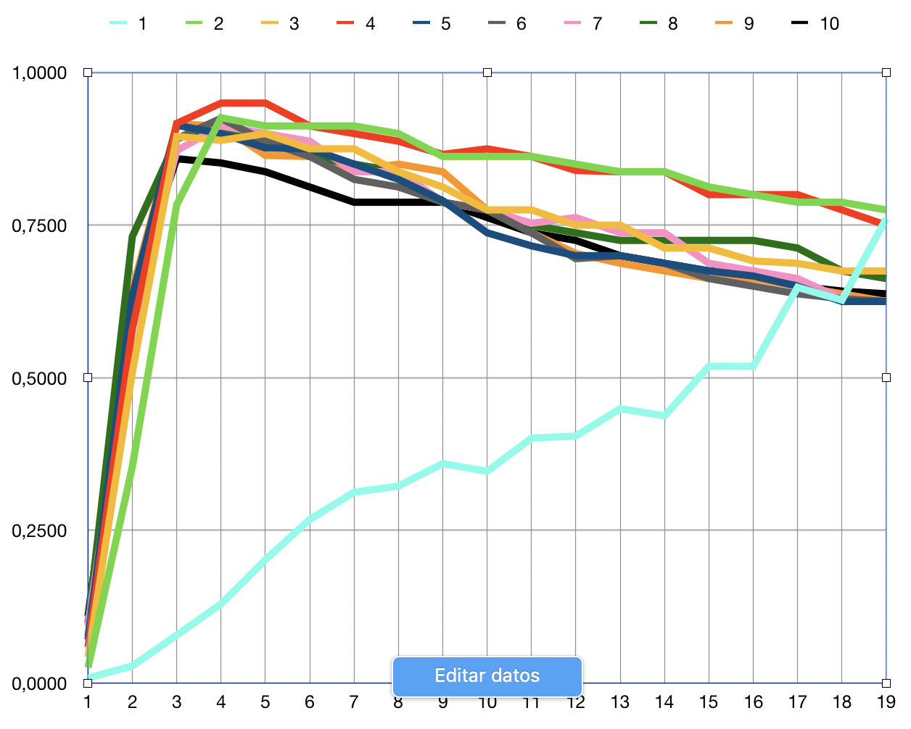

# Simhash

Se ha desarrollado un sistema de score de Documentos para relacionarlos media similitud, usando para ello una función Simhash que recibe una restricción (restrictiveness) y el numero de agrupaciones a realizar (ngram) para esto ultimo se ha utilizado la librería que proporciona el paquete NLTK.

Además se ha añadido una funcionalidad para la prueba con diferentes restricciones y n-gramas, lo que nos muestra que la mejor puntuación se alcanza con una restricción de 5 y 4 n-gramas, como se puede observar en la siguiente tabla

Nota: El dataset usado se puede descargar de aqui: [2008-Feb-02-04.json.gz](https://drive.google.com/file/d/0B6hoZsYYCKz0WklYQ0xLcU52ZUE/view)

